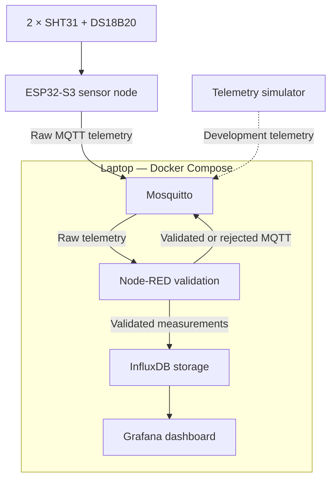

# System Architecture

## Status

Draft — subject to team review and approval.

## Architecture overview

MicroHydros uses an ESP32-S3 sensor node to collect environmental measurements. The ESP32-S3 performs basic sensor-read checks and publishes one raw telemetry message every 5 seconds over Wi-Fi using MQTT.

Mosquitto, Node-RED, InfluxDB and Grafana run as separate Docker containers on a laptop. Mosquitto routes MQTT messages. Node-RED validates, timestamps and separates the measurements before writing valid data to InfluxDB. Grafana reads the stored measurements from InfluxDB and displays current and historical data.

A telemetry simulator is used during development to imitate the ESP32-S3. It publishes messages using the same MQTT topics and data contract as the final device.

## Component responsibilities

| Component           | Responsibility                                                                 | MVP              |
| ------------------- | ------------------------------------------------------------------------------ | ---------------- |
| Internal SHT31      | Measure internal air temperature and relative humidity                         | Yes              |
| External SHT31      | Measure external air temperature                                               | Yes              |
| DS18B20             | Measure water or nutrient-solution temperature                                 | Yes              |
| ESP32-S3            | Read sensors, perform initial checks and publish raw MQTT telemetry            | Yes              |
| Mosquitto           | Route MQTT messages between publishers and subscribers                         | Yes              |
| Node-RED            | Validate, timestamp and separate measurements and write valid data to InfluxDB | Yes              |
| InfluxDB            | Store validated historical measurements                                        | Yes              |
| Grafana             | Display current and historical measurements                                    | Yes              |
| Telemetry simulator | Imitate ESP32-S3 telemetry during development and testing                      | Development only |
| Telegram            | Deliver external alarm notifications                                           | No               |

## Deployment architecture

The ESP32-S3 and demonstration laptop communicate through the same local network. The laptop hosts all backend services using Docker Compose.



The simulator is not part of the final deployed prototype. It is replaced by the ESP32-S3 when the hardware path is integrated.

## Sensor connections

The internal and external SHT31 sensors communicate with the ESP32-S3 using I²C. The DS18B20 communicates using 1-Wire.

The two SHT31 sensors must have unique I²C addresses. The intended mapping is:

| Sensor         | Software identifier | Intended I²C address |
| -------------- | ------------------- | -------------------- |
| Internal SHT31 | `internal_sht31`    | `0x44`               |
| External SHT31 | `external_sht31`    | `0x45`               |

The exact modules must be checked to confirm that address selection is supported. If both modules are fixed to the same address, separate I²C buses or an I²C multiplexer will be required.

## Docker deployment

The backend services are managed using Docker Compose on the laptop.

* Mosquitto, Node-RED, InfluxDB and Grafana run as separate containers.
* Containers should restart automatically after failure or host restart.
* Persistent volumes preserve Node-RED flows, InfluxDB measurements and Grafana configuration.
* Docker Compose files, Mosquitto configuration and reviewed Node-RED flow exports may be version controlled.
* Passwords, tokens, `.env` files and other credentials must not be committed.

Services inside Docker communicate using their Docker Compose service names. The ESP32-S3 connects to Mosquitto using the laptop’s local network IP address and port `1883`.

## Measurement data flow

1. The ESP32-S3 reads all three sensors every 5 seconds.
2. It checks for sensor communication and conversion failures.
3. It creates one raw JSON payload containing all four measurements, sensor statuses, device ID, boot ID, sequence number and uptime.
4. It publishes the payload to the device’s raw MQTT topic using QoS 1.
5. Node-RED subscribes to raw telemetry.
6. Node-RED validates the common metadata and each measurement independently.
7. Node-RED assigns one UTC timestamp to the measurement cycle.
8. Valid measurements are published to their individual validated topics and written to InfluxDB.
9. Message-level and measurement-level failures are published to the rejected topic.
10. Grafana reads stored measurements from InfluxDB and displays current and historical values.

A failed measurement must not prevent other valid measurements from being processed.

## MQTT topics

```text
microhydros/v1/devices/esp32s3-01/telemetry/raw
microhydros/v1/devices/esp32s3-01/telemetry/validated/{measurement}
microhydros/v1/devices/esp32s3-01/telemetry/rejected
microhydros/v1/devices/esp32s3-01/status
```

Node-RED subscribes to raw telemetry from every compatible device using:

```text
microhydros/v1/devices/+/telemetry/raw
```

Consumers can subscribe to all validated measurements using:

```text
microhydros/v1/devices/+/telemetry/validated/+
```

Node-RED subscribes to device availability using:

```text
microhydros/v1/devices/+/status
```

## Delivery behaviour

| Property               | Decision           |
| ---------------------- | ------------------ |
| Measurement interval   | 5 seconds          |
| MQTT QoS               | 1                  |
| Retained telemetry     | No                 |
| Retained device status | Yes                |
| Timestamp authority    | Node-RED           |
| Timestamp format       | UTC using ISO 8601 |
| Offline buffering      | Outside the MVP    |

QoS 1 can deliver a message more than once. Consumers can use `device_id`, `boot_id` and `sequence` together to identify one measurement cycle. The strategy for preventing duplicate historical records must be tested during integration.

A valid timestamp looks like:

```text
2026-09-08T10:15:30Z
```

## Validation and failure handling

Validation is performed at two levels.

### ESP32-S3 validation

The ESP32-S3 checks whether each sensor was read successfully before publishing.

If a sensor fails:

* Its measurement value is set to `null`.
* Its sensor status is set to an error value such as `read_error`.
* `NaN`, infinity or invented replacement values must not be published.
* The failed measurement may reach the raw topic for diagnostics, but it cannot become validated telemetry.

### Node-RED validation

Node-RED rejects the complete raw message if its common metadata or JSON structure cannot be trusted.

Examples include:

* Empty payload or invalid JSON
* Unsupported schema version
* Missing or invalid device ID
* Device ID that does not match the MQTT topic
* Missing or invalid boot ID, sequence number or uptime

Node-RED validates sensor measurements independently.

A measurement is rejected if:

* Its required field is missing.
* Its value is `null`.
* Its value is not a finite number.
* Its corresponding sensor status is not `ok`.
* Its value is outside the configured plausible sensor range.

Rejected data must not be written to normal InfluxDB measurement series or displayed as valid telemetry in Grafana.

### Validation versus alarms

Validation determines whether data is trustworthy enough to process.

An alarm determines whether a valid measurement is outside the desired growing conditions.

A measurement must not be rejected only because it is outside the preferred growing range. Alarm limits are separate from technical plausibility limits.

## Device availability

The ESP32-S3 publishes its availability to:

```text
microhydros/v1/devices/esp32s3-01/status
```

Online status and MQTT Last Will and Testament messages are retained.

If the ESP32-S3 disconnects unexpectedly, Mosquitto publishes its configured offline status. Node-RED receives the status message so the system can distinguish between stable measurements and a device that has stopped communicating.

## Demonstration environment

For the final demonstration:

* The ESP32-S3 and laptop must use the same local network.
* The laptop’s local IP address must be configured in the ESP32-S3 firmware.
* The firewall must allow the ESP32-S3 to reach MQTT port `1883`.
* The complete Docker Compose environment must be started and checked before the demonstration.
* Node-RED, InfluxDB and Grafana data must persist after container restarts.

Anonymous and unencrypted MQTT may be used only within the controlled prototype environment. Authentication and TLS should be added if the system is later deployed on an untrusted network.
